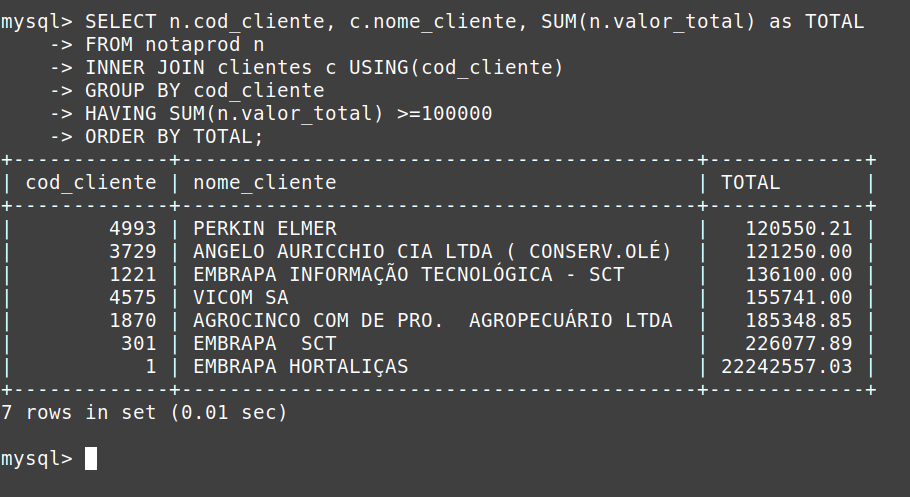

# How To Learn SQL in Practice

This tutorial help you learn SQL in Pratice.

# Get Start
Como aprender SQL praticando?

Nesse tutorial, elaborei um banco de dados já populado, para ajudá-lo a compreender melhor os conceitos básicos de SQL.

Para praticar, basta seguir o conteúdo da apostila: SQL da Teoria à Prática.pdf, e ir praticando as consultas junto com o bando de dados já populado e instalado na Máquina Virutal Ubuntu_server_mysql.zip (compatível com Virutal Box 6.1).

```
Usuário da Máquina Virutal: web
Senha do usuário da VM: web

Usuário do banco de dados: root
Senha do banco de dados: web

```

Caso queira instalar o banco já populado, basca importar o arquivo cursobdii.sql para o MySQL.

# Apostila


# Máquina Virutal


# Bando de Dados na Prática


## Exemplo de Consulta:

```

SELECT n.cod_cliente, c.nome_cliente, SUM(n.valor_total) as TOTAL 
FROM notaprod n 
INNER JOIN clientes c USING(cod_cliente) 
GROUP BY cod_cliente 
HAVING SUM(n.valor_total) >=100000 
ORDER BY TOTAL;

```
Saída esperada



